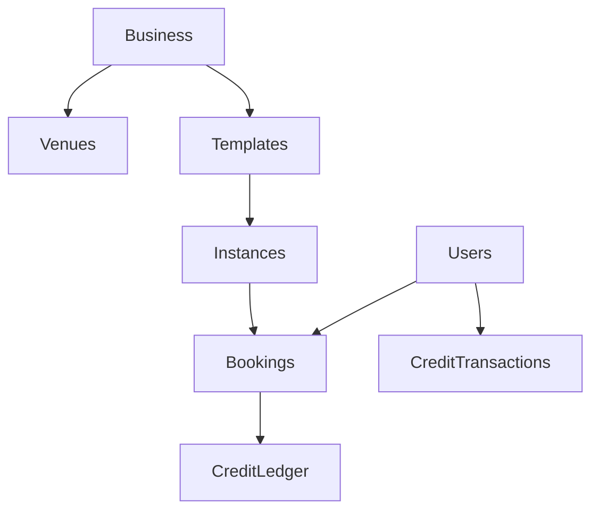

# CLAUDE.md

This file provides essential guidance for AI agents working with this comprehensive class/venue booking platform. **Before starting any task, AI agents must read the documentation in the order specified below.**

## 🤖 AI Agent Workflow - MANDATORY READING ORDER

### **1. FIRST: Read Application Context**
Before writing any code, AI agents MUST read the appropriate START_HERE.md file:

**For Backend Work:**
- **`packages/api/START_HERE.md`** - Complete business rules, backend architecture, and 75+ documented rules

**For Frontend Work:**
- **`apps/web-business/START_HERE.md`** - Business dashboard tech stack and patterns
- **`apps/web-consumer/START_HERE.md`** - Consumer app architecture and UX patterns  
- **`apps/mobile-consumer/START_HERE.md`** - Mobile app stack and React Native patterns

**For All Work:**
- **Architectural Decision Records (ADRs)** - Found inline in operations files as comments starting with `// ADR-XXX:`
- **Function Documentation** - JSDoc comments in operations files with real-world examples

### **2. THEN: Understand the Codebase Structure**
- Multi-tenant booking platform with businesses, venues, class templates, and instances
- Real-time updates via Convex backend
- Stripe payment integration with subscription and one-time purchases
- Mobile app with deep-linking support

### **3. FINALLY: Follow Development Patterns**
- Handler-based architecture replaced by Service-Layer Architecture (file-type organization)
- Safety-first testing approach focusing on business logic protection
- Comprehensive validation with centralized error codes

## Project Overview

Turborepo monorepo with pnpm workspaces for a comprehensive class/venue booking platform. Multi-tenant architecture supporting real-time bookings, dynamic pricing, and complete payment workflows.

**Core Technologies**: React 19, Convex, Stripe, TypeScript, Tailwind CSS, React Native

## Essential File Structure

### **Backend (`packages/api/`)**
- **`START_HERE.md`** 📚 **READ FIRST** - Complete business rules, backend architecture, and tech stack
- **`operations/`** - Business logic with comprehensive JSDoc and ADRs
  - **`pricing.ts`** - Dynamic pricing with discount hierarchy
  - **`classInstance.ts`** - Class scheduling and template operations
  - **`payments.ts`** - Stripe integration and credit management
  - **`venue.ts`** - Venue management with address validation
- **`services/`** - Service layer integrating operations
- **`convex/`** - Real-time database and API functions
- **`integrationTests/`** - End-to-end workflow testing
- **`validations/`** - Field-level validation with error attribution

### **Frontend Applications**
- **`apps/web-business/START_HERE.md`** 💼 **READ FOR BUSINESS DASHBOARD** - React 19 + TanStack Router management interface
- **`apps/web-consumer/START_HERE.md`** 🌐 **READ FOR CONSUMER WEB** - Customer booking interface with mobile-first design
- **`apps/mobile-consumer/START_HERE.md`** 📱 **READ FOR MOBILE APP** - React Native app with deep-linking and real-time booking

### **Shared Packages**
- **`packages/ui/`** - Shared React components
- **`packages/utils/`** - Common utilities and constants

## Key Business Domains

### **1. Pricing System** 
- Dynamic discounts: Early bird (10%) > Low capacity (5%)
- Tiered subscription pricing: 5-150 credits/month with volume discounts
- Base price chain: `instance.price → template.price → default(15)`

### **2. Class Scheduling**
- Templates create instances with calculated endTime from duration
- Business rule: Cannot update endTime without startTime (ADR-001)
- Historical snapshots preserve template/venue data at booking time

### **3. Credit System**
- Double-entry ledger with expiration (VIP: 5 months, regular: 3 months)
- Credits allocated only AFTER payment confirmation
- 20% system cut with business payouts

### **4. Multi-tenant Data Model**
- All entities include `businessId` for isolation
- Audit fields: `createdAt`, `createdBy`, `updatedAt`, `updatedBy`
- Soft deletes: `deleted`, `deletedAt`, `deletedBy`

## Development Commands

### **Development**
```bash
# Start all apps
pnpm dev

# Start specific app
pnpm dev --filter=web-business

# Start backend with dashboard
cd packages/api && pnpm dev
```

### **Testing & Quality**
```bash
# Run all tests
pnpm test

# Backend unit tests
cd packages/api && npx vitest

# Type checking
npx convex typecheck
```

### **Deployment**
```bash
# Deploy frontend
cd apps/web-business && pnpm deploy

# Deploy backend  
cd packages/api && npx convex deploy
```

## Critical Architecture Patterns

### **Service-Layer Architecture**
Operations organized by file type, not domain handlers:
- **`operations/`** - Pure business logic with comprehensive JSDoc
- **`services/`** - Database integration and external API calls
- **`validations/`** - Field validation with error attribution
- **`utils/`** - Utilities and helpers per domain subject
- **`types/`** - TypeScript definitions

### **Real-time Architecture**
- Convex provides live subscriptions for calendar, bookings, credits
- All booking changes propagate immediately to connected clients
- Mobile app receives real-time notifications with deep-links

### **Payment Safety**
- All credit operations are webhook-driven (Stripe `checkout.session.completed`)
- Idempotency keys prevent duplicate transactions
- Credits never allocated before payment confirmation

## Business Rule Examples (See packages/api/START_HERE.md for complete list)

### **PR-001: Discount Hierarchy**
```typescript
// Early bird (>48h) = 10% discount takes precedence over low capacity (5%)
// Code: operations/pricing.ts:45-57
// Tests: operations/pricing.test.ts:133-149
```

### **CS-001: Time Update Rule (ADR-001)**
```typescript
// Cannot update endTime without startTime - prevents calendar corruption
// Code: operations/classInstance.ts:34-44
// Tests: operations/classInstance.test.ts:60-68
```

### **DI-001: Historical Snapshots (ADR-006)**
```typescript
// Template/venue snapshots preserve booking confirmation data
// Code: operations/classInstance.ts:165-183
// Tests: operations/classInstance.test.ts:201-236
```

## Key Data Relationships



## Error Handling Standards

- **Centralized Error Codes**: `utils/errorCodes.ts` - never hardcode error strings
- **Field Attribution**: All validation errors include field names for UX
- **Structured Errors**: `ConvexError({ message, field, code })`

## Timezone Management

- **Business timezone is source of truth** - all scheduling in business timezone
- **Mobile App Policy**: Greece-only (`Europe/Athens`) for consistency
- **Utilities**: `timezone-utils.ts` for conversion between database UTC and display time

## Testing Philosophy

- **Safety over Coverage**: Focus on preventing business-damaging bugs
- **Integration-First**: Backend business logic tested via integration tests
- **E2E Frontend**: Playwright for critical user journeys
- **Real-world Scenarios**: Test with actual business data patterns

## Payment Integration

### **Stripe Configuration**
- **API Version**: 2025-02-24.acacia
- **Currency**: EUR (€) for subscriptions, USD ($) for one-time purchases
- **Webhook Events**: `checkout.session.completed`, subscription lifecycle events

### **Credit Pricing**
- **Subscriptions**: €1.80-€2.00 per credit with tiered discounts
- **One-time**: $2.06-$2.30 per credit with pack-based discounts

## Mobile Deep-linking

- **Scheme**: `kymaclub://class/:id`, `kymaclub://booking/:id`
- **Fallback**: Web URLs for unsupported environments
- **Integration**: Push notifications, payment redirects, email links

---

## 🚨 CRITICAL REMINDERS for AI Agents

1. **Read appropriate `START_HERE.md` FIRST** - Each app/package has comprehensive context and business rules
2. **Check ADR comments** - Understand architectural decisions before making changes
3. **Use comprehensive JSDoc** - All operations files have detailed examples and usage patterns
4. **Safety-first approach** - Financial operations must be bulletproof
5. **Test your changes** - Run relevant tests to ensure business logic integrity
6. **Follow existing patterns** - Use established validation, error handling, and data structures
7. **🔄 UPDATE DOCUMENTATION** - After implementing changes, update relevant documentation:
   - Add new business rules to `packages/api/START_HERE.md` with code references
   - Add ADR comments for architectural decisions (format: `// ADR-XXX: Decision - Rationale`)
   - Update JSDoc examples if function behavior changes
   - Update relevant `START_HERE.md` files if new patterns are introduced

## 📋 Documentation Update Checklist

After implementing any feature or change, AI agents MUST review and update:

- [ ] **New business rules?** → Add to `packages/api/START_HERE.md` with code references and tests
- [ ] **Architectural decision made?** → Add ADR comment in code with rationale and alternatives considered  
- [ ] **Function behavior changed?** → Update JSDoc examples and parameter descriptions
- [ ] **New critical patterns introduced?** → Update relevant `START_HERE.md` files with examples
- [ ] **Error codes added?** → Update centralized error handling documentation
- [ ] **Integration points changed?** → Update API documentation and integration test references

When in doubt about any business rule, check the documentation in this order:
1. **Appropriate `START_HERE.md`** for business context and technical architecture
2. **ADR comments in code** for architectural decisions  
3. **JSDoc examples** for implementation patterns
4. **Integration tests** for expected behavior

**Remember**: Documentation is code. Keep it accurate, current, and comprehensive for future AI agents.